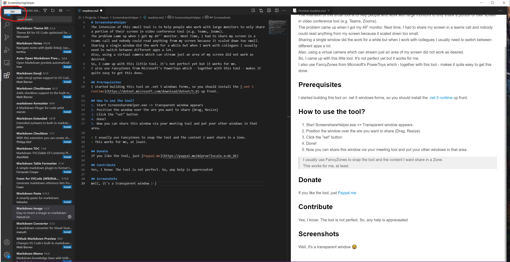

# ScreenshareHelper
The intension of this small tool is to help people who work with large monitors to only share a portion of their screen in video conference tool (e.g. Teams, Zooms).
The problem came up when I got my 49'' monitor. Next time, I had to share my screen in a teams call and nobody could read anything from my screen because it scaled down too small.
Sharing a single window did the work for a while but when I work with collegues I usually need to switch between different apps a lot.
Also, using a virtual camera which can stream just an area of my screen did not work as desired.
So, I came up with this little tool. It's not perfect yet but it works for me.
I also use FancyZones from Microsoft's PowerToys which - together with this tool - makes it quite easy to get this done.

## Prerequisites
I started building this tool on .net 5 windows forms, so you should install the [.net 5 runtime](https://dotnet.microsoft.com/download/dotnet/5.0) up front.

## Download

[ScreenshareHelper.exe](https://github.com/michiproep/ScreenshareHelper/tree/master/bin)
Either use x86 or x64 precompiled verion.

## How to use the tool?
1. Start ScreenshareHelper.exe => Transparent window appears
2. Position the window over the are you want to share (Drag, Resize)
3. Click the "set" button
4. Done!
5. Now you can share this window via your meeting tool and put your other windows in that area.

> I usually use FancyZones to snap the tool and the content I want share in a Zone.
> This works for me, at least.

>I also pinned a link to the tool to my taskbar. This way, it's a single click for to get it up and running since it remembers it's last position and it's last capture area.

You can actually move the tool to another screen (if you wish and got one) - once you set the capture area with the set-button. This way you can actually see what's happening 

## Command Line Options / SnapToProcess
You can create a .bat file or use a desktop shortcut to add command line options to let the tool snap to a certain process on startup.
Use process name or better process ID (MainWindow process ID) to accomplish this.

-n => Process name (e.g. firefox)
-i => PID

Examples
```
ScreenshareHelper.exe -n notepad2
ScreenshareHelper.exe -i 12345
```
## Donate
If you like the tool, just [Paypal.me](https://paypal.me/mlproe?locale.x=de_DE)

## Contribute
Yes, I know: The tool is not perfect. So, any help is appreceated

## Screenshots
Well, it's a transparent window :-)

  
