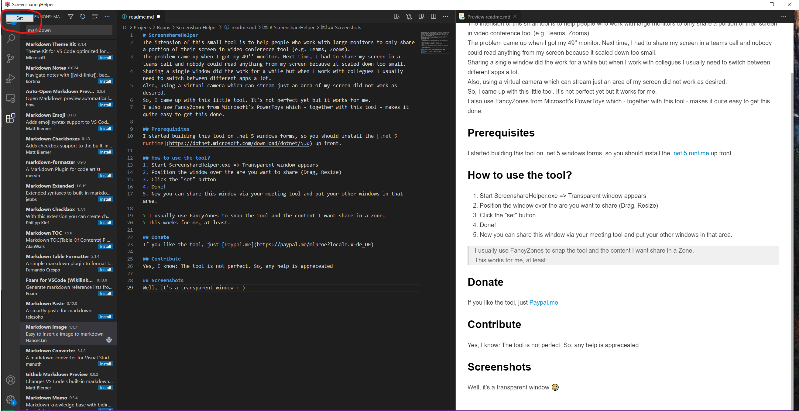

# ScreenshareHelper
The intension of this small tool is to help people who work with large monitors to only share a portion of their screen in video conference tool (e.g. Teams, Zooms).
The problem came up when I got my 49'' monitor. Next time, I had to share my screen in a teams call and nobody could read anything from my screen because it scaled down too small.
Sharing a single window did the work for a while but when I work with collegues I usually need to switch between different apps a lot.
Also, using a virtual camera which can stream just an area of my screen did not work as desired.
So, I came up with this little tool. It's not perfect yet but it works for me.
I also use FancyZones from Microsoft's PowerToys which - together with this tool - makes it quite easy to get this done.

## Prerequisites
This tool is built on .NET 10 Windows Forms, so you need the [.NET 10 Desktop Runtime](https://dotnet.microsoft.com/download/dotnet/10.0) installed up front.

## Download

Download the latest zip from the [releases page](https://github.com/michiproep/ScreenshareHelper/releases/latest).
Use `win-x64` (most PCs) or `win-x86`.

## How to use the tool?
1. Start ScreenshareHelper.exe => Transparent window appears
2. Position the window over the area you want to share (Drag, Resize)
3. Click the "set" button
4. Done!
5. Now you can share this window via your meeting tool and put your other windows in that area.

> I usually use FancyZones to snap the tool and the content I want share in a Zone.
> This works for me, at least.

>I also pinned a link to the tool to my taskbar. This way, it's a single click for to get it up and running since it remembers it's last position and it's last capture area.

You can actually move the tool to another screen (if you wish and got one) - once you set the capture area with the set-button. This way you can actually see what's happening 

## Command Line Options / SnapToProcess
You can create a .bat file or use a desktop shortcut to add command line options to let the tool snap to a certain process on startup.
Use process name or better process ID (MainWindow process ID) to accomplish this.

-n => Process name (e.g. firefox)
-i => PID
--no-mouse => Disable mirroring the mouse pointer.
--color => Background color: a named color, a hex code RRGGBB/AARRGGBB, or 'Transparent'.
--auto-set => Automatically set the capture area (like clicking 'Set') when the window loses focus.
--capture => Capture method: `dxgi` (Desktop Duplication, default), `gdi` (classic, falls back to it automatically if dxgi fails) or `wgc` (Windows.Graphics.Capture).
--fps => Target frames per second (default 30).
--stats => Show capture method, frame rate and capture time in the window.
--virtual-camera => *Windows 11, x64:* also publish the capture area as a webcam named "ScreenshareHelper" (see [Virtual camera](#virtual-camera)).
--install-camera / --uninstall-camera => Set up or remove the virtual camera and exit (asks for administrator rights).

Examples
```
ScreenshareHelper.exe -n notepad2
ScreenshareHelper.exe -i 12345
```
## Virtual camera
*Experimental, Windows 11, x64 package only.* With `--virtual-camera` the tool additionally shows the capture area as a webcam called **ScreenshareHelper** (1920×1080, scaled with black bars, including the mouse pointer). Select it as camera in Teams, Zoom or the Windows Camera app. The camera exists while the tool is running.

The first time you use it, the tool offers a one-time setup: after confirming the Windows admin prompt it copies the camera component (`ScreenshareHelper.VirtualCamera.dll`) to `C:\Program Files\ScreenshareHelper\VirtualCamera` and registers it there. Windows' camera service loads it from that protected folder. After an update with a changed camera component, the tool offers to update it the same way.

To remove it: `ScreenshareHelper.exe --uninstall-camera`.

> Camera images are compressed more than screen sharing, so small text may be less sharp than when sharing the window.

## Donate
If you like the tool, just [Paypal.me](https://paypal.me/mlproe?locale.x=de_DE)

## Contribute
Yes, I know: The tool is not perfect. So, any help is appreceated

## Screenshots
Well, it's a transparent window :-)

  
